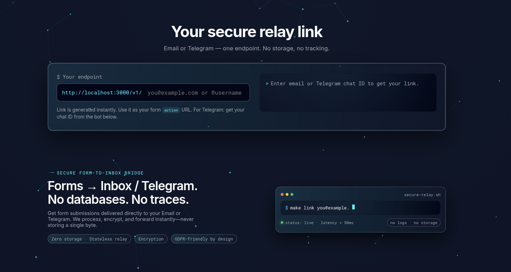

# SMTP/Telegram Form Relay

[](https://nodejs.org/)
[](https://www.typescriptlang.org/)
[](LICENSE)

A minimal, secure **form relay** that forwards HTML form submissions to **email** (SMTP) or **Telegram**. Point your
form `action` at `https://your-service/v1/recipient` — use an email address or a Telegram chat ID as the recipient. No
backend logic needed on your site.



---

## No storage, no database, no registration

**User personal data is not stored.** 
The service does not use databases, files, or caches. The recipient is specified only in the form URL; for Telegram, the user obtains their chat ID via a bot and enters it into the form. No registration or mapping is required—maximum privacy.
---

## Problem & Solution

**Problem:** Static sites and simple frontends have no backend to send contact/form data to email or messengers. You
don't want to expose SMTP credentials in the browser or use a heavy backend.

**Solution:** This service exposes a single endpoint `POST /v1/:recipient`. You set your form’s `action` to
`https://your-relay.example.com/v1/recipient@example.com` (email) or `https://your-relay.example.com/v1/123456789` (
Telegram chat ID). On submit, the relay validates the recipient, parses the form body (urlencoded or multipart), and
sends via your SMTP or Telegram bot. Rate limiting, request size limits, and security headers included.

---

**Landing page:** The root URL (`/`) serves a static site from the `public/` folder. The contact form can send messages
through the relay once you enter your email or Telegram chat ID in the relay link field.

## Quick Start

### With Docker Compose (recommended)

One command runs the service with SMTP (MailHog) and optional Telegram:

```bash
docker-compose up --build
```

1. Copy env and set at least SMTP vars (MailHog is preconfigured in `docker-compose`):
   ```bash
   cp .env.example .env
   # For MailHog: SMTP_HOST=mailhog, SMTP_PORT=1025, SMTP_FROM=noreply@localhost
   # Optional: TELEGRAM_BOT_TOKEN=your_bot_token for Telegram delivery
   ```
2. Run `npm install` once to generate `package-lock.json` (then `npm ci` in CI/Docker).
3. Start: `docker-compose up -d` (or `docker-compose up --build` for rebuild).
4. Test email:
   ```bash
   curl -X POST http://localhost:3000/v1/your@email.com -d "name=Test&message=Hello"
   ```
5. MailHog UI: http://localhost:8025

### Without Docker

1. **Requirements:** Node.js 18+
2. Install, build, configure:
   ```bash
   npm ci
   npm run build
   cp .env.example .env
   # Edit .env: SMTP_* and optionally TELEGRAM_BOT_TOKEN
   ```
3. Run: `npm start` (dev: `npm run dev`).

---

## Environment Variables

| Variable               | Required | Description                                                                    |
|------------------------|----------|--------------------------------------------------------------------------------|
| `PORT`                 | No       | Server port (default: 3000)                                                    |
| `NODE_ENV`             | No       | `development` \| `test` \| `production`                                        |
| `SMTP_HOST`            | Yes      | SMTP server hostname                                                           |
| `SMTP_PORT`            | No       | SMTP port (default: 587)                                                       |
| `SMTP_SECURE`          | No       | `true` for 465, `false` for 587/25 (default: false)                            |
| `SMTP_USER`            | No       | Auth username (empty for no auth)                                              |
| `SMTP_PASS`            | No       | Auth password                                                                  |
| `SMTP_FROM`            | Yes      | Sender address for outgoing mail                                               |
| `TELEGRAM_BOT_TOKEN`   | No       | Bot token from BotFather; if set, Telegram delivery and /start bot are enabled |
| `RATE_LIMIT_WINDOW_MS` | No       | Rate limit window in ms (default: 60000)                                       |
| `RATE_LIMIT_MAX`       | No       | Max requests per window per IP (default: 10)                                   |
| `BODY_LIMIT`           | No       | Max request body size in bytes (default: 10MB)                                 |

---

## API

### `POST /v1/:recipient`

Sends the request body (form fields and optional files) to the given recipient.

- **Parameter:** `recipient` — either a **valid email address** (for SMTP) or a **Telegram chat ID** (numeric string,
  1–32 digits). Invalid format returns 400.
- **Request:** `Content-Type: application/x-www-form-urlencoded` or `multipart/form-data`.
- **Response:**
    - `200 OK` — body `OK` when the message was sent.
    - `400 Bad Request` — invalid or missing recipient in path.
    - `429 Too Many Requests` — rate limit exceeded.
    - `501 Not Implemented` — recipient is Telegram chat ID but `TELEGRAM_BOT_TOKEN` is not set.
    - `502 Bad Gateway` — Telegram delivery failed (e.g. chat not found, bot blocked by user).
    - `500 Internal Server Error` — SMTP or server error.

**Example (email):**

```html

<form method="POST" action="https://your-relay.example.com/contact@yourdomain.com">
    <input name="name" placeholder="Name"/>
    <input type="email" name="email" placeholder="Email"/>
    <textarea name="message"></textarea>
    <button type="submit">Send</button>
</form>
```

```bash
curl -X POST https://your-relay.example.com/you@example.com \
  -d "name=Jane&email=jane@example.com&message=Hello"
```

---

## Telegram Integration (No Storage)

Delivery to Telegram uses your bot and the recipient’s **chat ID** in the URL. No database, no username mapping, no
registration — the user gets their ID from the bot and uses it in the form.

1. **Create a bot:** [@BotFather](https://t.me/BotFather) → /newbot → copy the token.
2. **Configure:** Add to your environment:
   ```bash
   TELEGRAM_BOT_TOKEN=your_bot_token_here
   ```
3. **Start the service** (e.g. `docker-compose up --build` or `npm start`).
4. **Get chat ID:** Anyone who wants to receive form submissions starts your bot (sends `/start`). The bot replies with
   their numeric **chat ID** and a short usage hint.
5. **Use in forms:** Put that chat ID in the form `action` URL:
   ```html
   <form method="POST" action="https://your-server.example.com/123456789">
     <input name="name" placeholder="Name" />
     <textarea name="message"></textarea>
     <button type="submit">Send</button>
   </form>
   ```
6. **Example (curl):**
   ```bash
   curl -X POST https://your-server.example.com/123456789 \
     -d "name=Test&message=Hello from form"
   ```

**Limitation:** The bot can send messages only to users who have started it at least once (sent `/start`). No data about
users or chat IDs is stored on the server.

---

## Running Tests

- **Typecheck:** `npm run typecheck`
- **All tests:** `npm test`
- **Unit only:** `npm run test:unit`
- **Integration only:** `npm run test:integration`
- **E2E (with MailHog):** Set `SMTP_HOST=localhost`, start MailHog (e.g. `docker-compose up -d mailhog`), then
  `npm run test:e2e`

Coverage is reported in `coverage/` and enforced (e.g. ≥80% in Jest config).

---

## Docker

- **Build:** `docker build -t smtp-form-relay .`
- **Run:** Pass env via file or `-e`:
  ```bash
  docker run -p 3000:3000 --env-file .env smtp-form-relay
  ```
- **Compose:** `docker-compose up --build` runs the app and MailHog; add `TELEGRAM_BOT_TOKEN` to env for Telegram. One
  command for SMTP + optional Telegram.

The image runs as non-root user `node` (see Dockerfile).

---

## Deploy

- **Render / Heroku:** Use Docker or buildpack; set env vars (`SMTP_*`, `SMTP_FROM`, optional `TELEGRAM_BOT_TOKEN`). Use
  HTTPS in production.
- **VPS:** Run with Node or Docker; put behind nginx/Caddy with HTTPS.

---

## Security

- **Rate limiting** per IP (configurable).
- **Request size** limit (default 10 MB).
- **Helmet** for security headers.
- **Recipient validation** (email format or numeric Telegram chat ID; no path traversal).
- **Input sanitization** for message body (newlines/control chars).
- **No storage** of form data or user identifiers.

---

## License

MIT. See [LICENSE](LICENSE).
